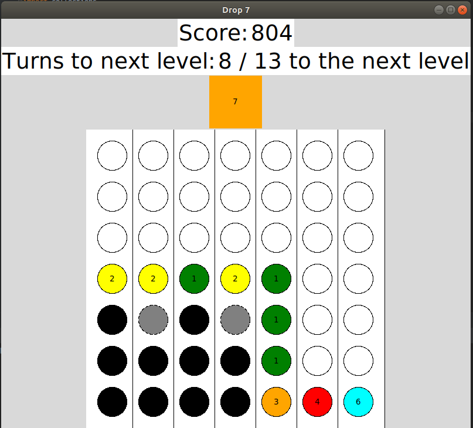
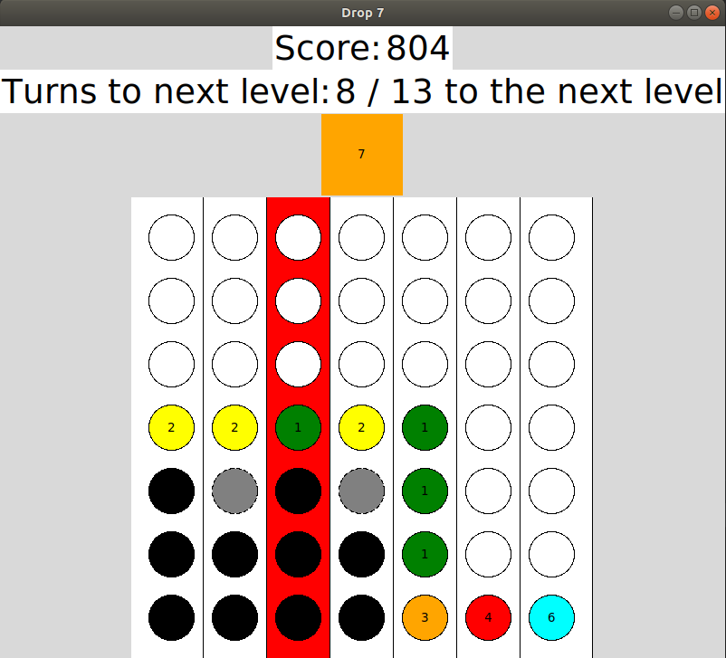

# Drop7
This project is a remake of the game called 'Drop7' from Zynga. It was part of the KU Leuven course 'Methodiek van de informatica' in 2018.

# Screenshots

The user interface of the game.

The user interface where one column is selected.
